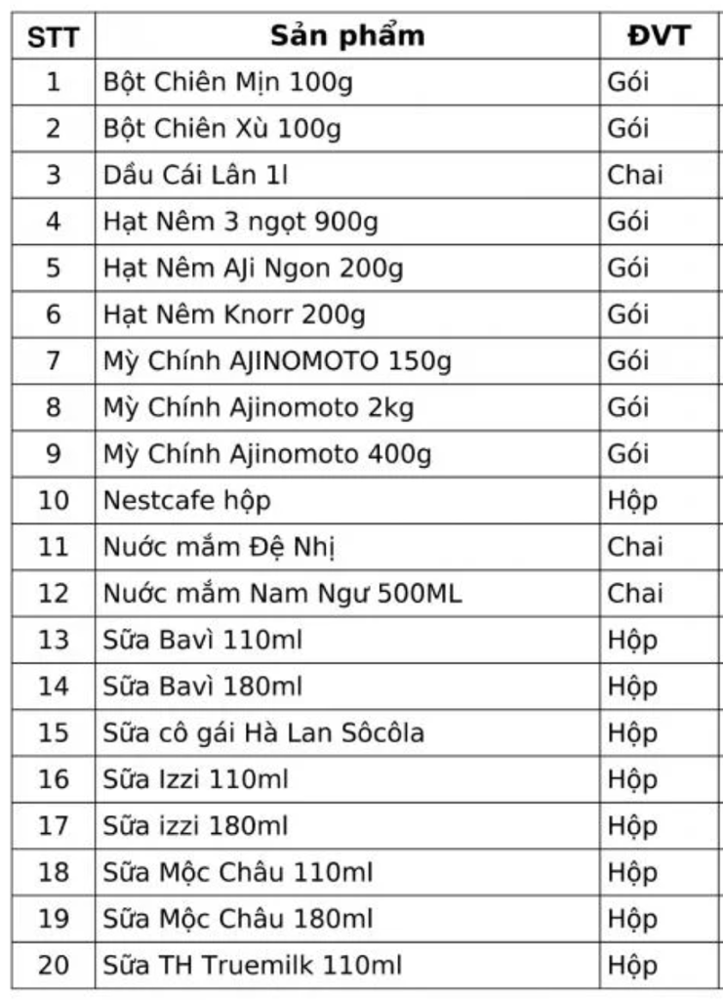
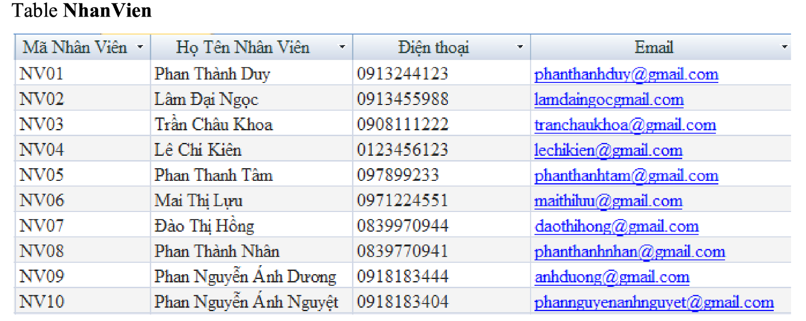
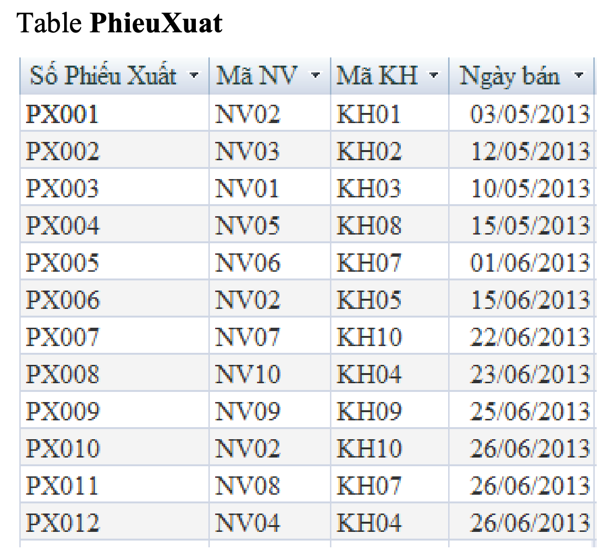
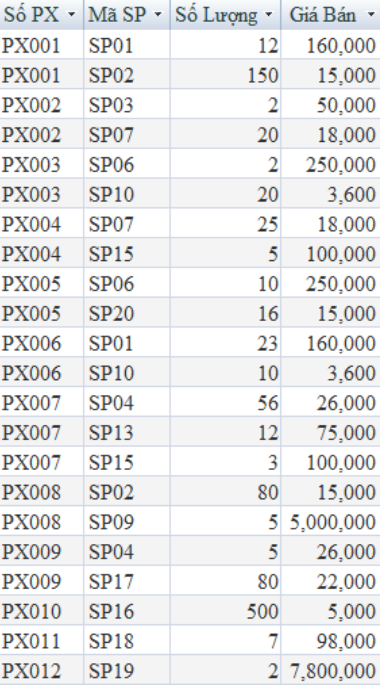

# Bài tập CSDL buổi 3
Tạo CSDL bán hàng như sau: *Lưu ý tên cột và tên bảng không bỏ dấu tiếng Việt.*

SANPHAM(**MaSP**, TenSP, DVT): `MaSP` là khóa chính, `tenSP` và `DVT` not nul

(thay cột `STT` thành `MaSP` và nhập các giá trị là SP01..SP20)

Bảng Nhanvien(**MaNV**, HotenNV, Dienthoai, Email)
- có `MaNV` là khóa chính, `hoten` not null, `DT` not null, `Email` null

Tạo bảng `Khachhang` tương tự bảng `Nhanvien` (tự nhập 10 khách hàng từ KH01..KH10)
Khachhang(**MaKH**, TenKH, Dienthoai, Email)

Bảng Phieuxuat(**SoPX**, *MaNV, MaKH*, Ngayban)
- `SoPX` là khóa chính, 
- `MaNV`, `MAKH` là khóa ngoại.

Bảng ChitietPX(***SoPX, MaSP***, Soluong, Giaban)
- `SoPX` và `MaSP` là khóa ngoại
- Khóa chính: (SoPX, MASP)
- `Soluong` và `giaban` > 0

- Thay giá bán của dòng (PX008, P09) thành 5100000
- Xóa dòng (PX004, SP07)
- Thay cấu trúc cột `giaban` thành `Numeric(12,1)`
