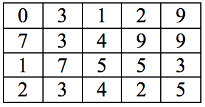

# Mê cung số (number maze)
Cho một mê cung số được biểu diễn bằng một mảng 2 chiều chứa các con số từ 0 đến 9 (xem hình bên dưới).

Một con robot được đặt tại **góc trên bên trái** của mê cung và muốn đi đến góc dưới bên phải của mê cung. Con robot có thể đi lên, xuống, qua trái và qua phải 1 ô. Chi phí để đi đến một ô bằng với con số bên trong ô đó.

Hãy tìm cách giúp con robot đi đến ô **góc dưới phải** sao cho tổng chi phí thấp nhất.

Đường đi có chi phí thấp nhất cho ví dụ này là 24.

Đầu vào (Input)
- Dữ liệu đầu vào được nhập từ bàn phím với định dạng:
  - Dòng dầu chứa 2 số nguyên M N (M: số hàng, N: số cột)
  - M dòng tiếp theo mô tả các số trong mê cung

Đầu ra (Output)
- In ra màn hình chi phí thấp nhất để con robot đi từ góc trên bên trái về góc dưới bên phải.
- Trong ví dụ trên, cần in ra màn hình: 24.

Gợi ý
- Mô hình hoá bài toán về đồ thị có hướng
  - Đỉnh ~ ô
  - Cung ~ hai ô cạnh nhau
  - Trọng số cung (u, v) = giá trị của ô tương ứng với đỉnh v.
