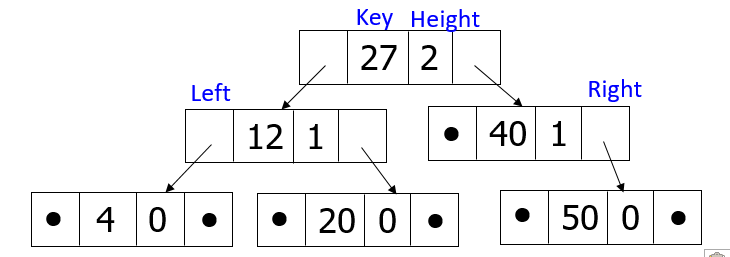

Cho mô hình một cây AVL được cài đặt bằng con trỏ như sau:

Hãy viết khai báo cho kiểu dữ liệu cây tìm kiếm nhị phân cân bằng về chiều cao AVL với các thành phần được mô tả như trên.

Chú ý
- Chỉ viết phần khai báo, KHÔNG VIẾT TOÀN BỘ CHƯƠNG TRÌNH
