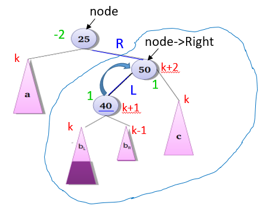
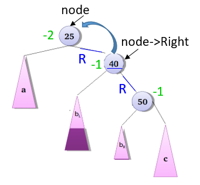

Giả sử kiểu dữ liệu cây tìm kiếm nhị phân cân bằng về chiều cao AVLTree đã được khai báo và các phép toán cơ bản trên cây cũng đã được cài đặt:
```c
typedef int KeyType;
struct Node{
	KeyType Key;
	int     Height;
	struct Node *Left, *Right;
};
typedef struct Node* AVLTree;
/* Liet ke (Key,Height) cua cac nut tren cay theo cach duyet tien tu */ 
void printNLR(AVLTree root)
/* Liet ke (Key,Height)cua cac nut tren cay theo cach duyet hau tu */
void printLRN(AVLTree root)
/* Tim va tra ve nut co khoa k trong cay */
AVLTree search(KeyType k, AVLTree root)
int max(int a, int b)
/* Tim chieu cao cua mot nut */
int getHeight(AVLTree node)
/* Tinh he so can bang cua mot nut */
int getBalance(AVLTree node)
/* Quay don qua trai cho truong hop mat can bang ben phai cua con phai */
AVLTree leftRotate(AVLTree node)
/* Quay don qua phai cho truong hop mat can bang ben trai cua con trai */
AVLTree rightRotate(AVLTree node)
/* Quay kep phai, trai cho truong hop mat can bang ben trai cua con phai */
AVLTree rightleftRotate(AVLTree node) 
/* Them nut co khoa key vao cay AVL */
AVLTree insertNode(KeyType key,AVLTree root)
```
Viết hàm xử lý trường hợp mất cân bằng bên phải của con trái

**Nguyên mẫu (Prototype)**
- Tên hàm: rightleftRotate()
- Tham số: node - AVLTree
- Kiểu trả về: AVLTree

Gợi ý: Quay kép phải - trái cho trường hợp mất cân bằng bên phải của con trái
<p float="left">
	
	
</p>

Chú ý
- Chỉ viết hàm, KHÔNG VIẾT TOÀN BỘ CHƯƠNG TRÌNH
