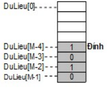

Cho mô hình một ngăn xếp cài đặt bằng mảng như sau:

Trong đó M = SoPhanTu= 100

Giả sử kiểu dữ liệu NganXep đã được khai báo. Viết hàm kiểm tra ngăn xếp rỗng.

Nguyên mẫu (Prototype)
- Tên hàm: ktRong()
- Tham số: S - NganXep
- Kiểu trả về: số nguyên

Thân hàm (Body)
- Trả về 1 nếu ngăn xếp rỗng, 0 nếu không rỗng

Gợi ý
- Kiểm tra đỉnh có là SoPhanTu hay không?

Chú ý
- Chỉ viết hàm, KHÔNG VIẾT TOÀN BỘ CHƯƠNG TRÌNH
