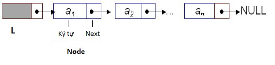

Người ta cần quản lý một câu trong tiếng Việt bẳng một danh sách liên kết mỗi phần tử là 1 ký tự. Khai báo này được cho sẵn như sau:
```c
struct Node{
   char KyTu;
   struct Node* Next;
};
typedef struct Node* Cau;
```
Hình ảnh của câu L (Cau L) có dạng như bên dưới

 

Giả sử khai báo kiểu Cau đã được định nghĩa. Hãy viết 1 hàm nối ký tự c vào 1 câu cho trước

Nguyên mẫu
- Tên hàm: chenKyTu()
- Tham số: 
  - c - Ký tự
  - con trỏ Cau
- Kiểu trả về: không

Thân hàm
- Nối ký tự c vào cuối câu được chỉ bởi con trỏ pD

Chú ý
- Chỉ viết phần hàm, KHÔNG VIẾT TOÀN BỘ CHƯƠNG TRÌNH

Gợi ý
- Di chuyển đến cuối câu và thêm ký tự c vào vị trí cuối này
