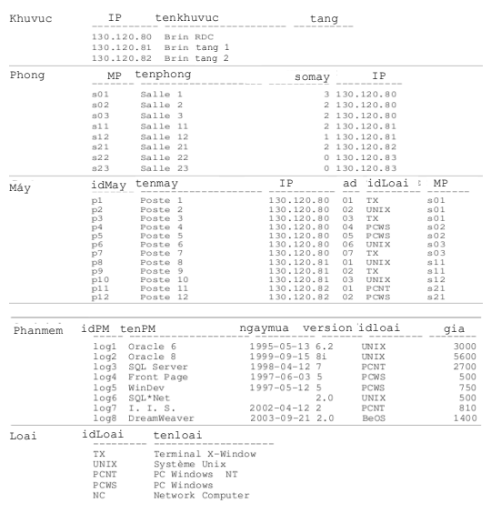
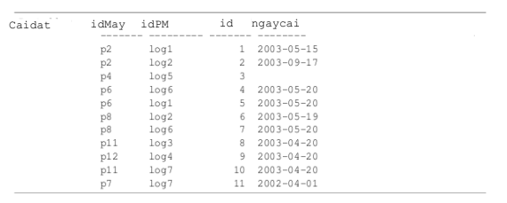

# Bài thực hành số 1
Cho lược đồ cơ sở dữ liệu sau:
- Khuvuc(IP, **tenKhuvuc**, tang)
- Phòng (**MP**, tenphong, *somay* , *IP*)
- May (**idMay**, tenmay, *IP*, ad, *idloai*, *MP*)
- Phanmem(**idPM**, tenPM, ngaymua, version, *idloai*, gia)
- Caidat (**id**, *idMay*, *idPM*, ngaycai)
- Loai (**idloai**, tenloai)

Viết script `hoten_bt1.sql` bao gồm các câu trả lời cho các câu hỏi sau :

1) Tạo các bảng cho lược đồ CSDL trên, chú ý định nghĩa các khóa chính, khóa ngoại, các ràng buộc NULL, NOT NULL, miền trị và giá trị mặc định sau:
- Tên của các khu vực, phòng, máy, phần mềm, loại không NULL
- Miền giá trị của cột ad có giá trị từ 0 đến 255
- Cột giá lớn hơn hoặc bằng 0
- Cột ngaycai có giá trị mặt định là ngày hiện tại

2) Thêm các dữ liệu trong các bảng sau cho các bảng vừa tạo ở câu 1

3) Sửa đổi cột tang của bảng Khuvuc để có số tầng đúng. Nghĩa là 0 cho 130.120.80, 1 cho 130.120.81, 2 cho 130.120.82.

4) Giảm 10% giá của các phần mềm kiểu 'PCNT'.

5) Thêm cột nbLog (số phần mềm mỗi máy) kiểu SMALLINT vào trong bảng May và cột nbInstall (số lần cài đặt mỗi phần mềm) kiểu SMALLINT vào trong bảng Phầnmềm. Cập nhật 2 cột này những giá trị sau:

| idPM | nbInstall | idMay | nbLog |
|------|-----------|-------|-------|
| log1 | 2         | p1    | 0     |
| log2 | 2         | p2    | 2     |
| log3 | 1         | p3    | 0     |
| log4 | 1         | p4    | 1     |
| log5 | 1         | p5    | 0     |
| log6 | 2         | p6    | 2     |
| log7 | 2         | p7    | 1     |
|      |           | p8    | 2     |
|      |           | p9    | 0     |
|      |           | p10   | 0     |
|      |           | p11   | 2     |
|      |           | p12   | 1     |

6) Tạo bảng PhanmemUNIX(idPM, tenPM, ngaymua, version) có cấu kiểu dữ liệu tương tự như bảng Phanmem đã tạo.

7) Thêm Khóa chính idPM cho bảng PhanmemUNIX vừa tạo

8) Thêm cột giá cho bảng vừa tạo

9) Thay đổi kiểu cho cột version thành VARCHAR(15) cho bảng PhanmemUNIX vừa tạo

10) Thêm ràng buộc duy nhất cho cột tên phần mềm cho bảng PhanmemUNIX vừa tạo

11) Thêm dữ liệu cho bảng PhanmemUNIX bằng cách lấy dữ liệu từ bảng Phanmem

12) Xóa cột version khỏi bảng PhanmemUNIX

13) Xóa các phần mềm trong bảng phần mềm có giá lớn hơn 5000? Giải thích kết quả

14) Xóa các phần mềm trong bảng phanmemUNIX có giá lớn hơn 5000? Giải thích kết quả

15) Xóa bảng Phanmem? Giải thích kết quả

16) Xóa bảng PhanmemUNIX? Giải thích kết quả

17) Xóa các cột nbLog và nbInstall
