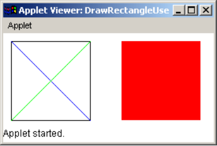
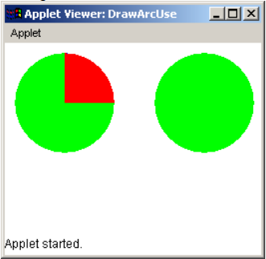
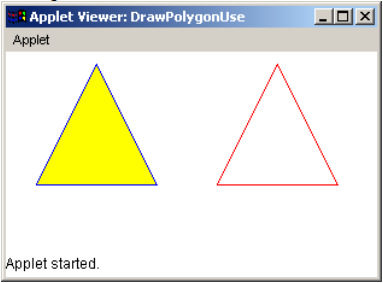
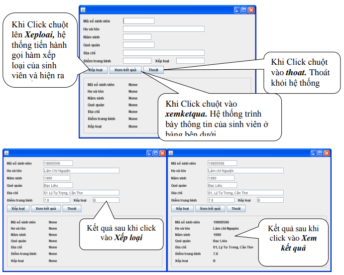
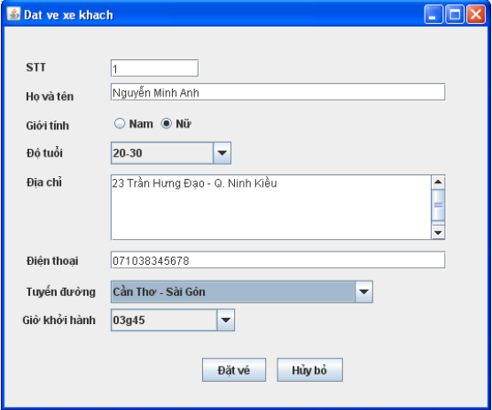
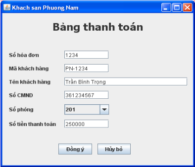

# Buổi 2: Applet và lập trình giao diện
## Phần 1: Applet
Áp dụng phương thức drawLine(), drawRectangle() và fillRectangle() để viết chương trình vẽ một hình vuông có 2 đường chéo và một hình vuông được tô màu để cho ra kết quả như sau:

Áp dụng phương thức drawOval(), drawArc(), fillOval(), fillArc() để viết chương trình cho kết quả sau:

Áp dụng các phương thức drawPolygon() , fillPolygon() để viết chương trình vẽ hình tam giác.

## Phần 2: Lập trình giao diện
### Bài tập 1
Sinh viên thiết kế Form quản lý thông tin của sinh viên. Có hình dạng sau:

### Bài tập 3
Thiết kế giao diện của 1 frame đặt vé xe khách của 1 công ty xe khách chất lượng cao như sau:

- Số thứ tự khách hàng đồng thời cũng là số ghế của khách, yêu cầu phải là số
- Họ tên khách hàng dùng để liên lạc yêu cầu không rỗng
- Độ tuổi của khách gồm các nhóm: dưới 20, 20-30, 30-40, trên 40
- Địa chỉ rước khách, điện thoại liên lạc cũng yêu cầu không rỗng
- Tuyến đường gồm: Cần Thơ – Châu Đốc, Cần Thơ – Sài Gòn
- Giờ khởi hành gồm: 3:45, 6:30

Nếu khách hàng nhấn nút “Đặt vé” thì kiểm tra dữ liệu nhập vào theo các ràng buộc bên trên, nếu không hợp lệ thì xuất thông báo ra cửa số lệnh, nếu tất cả đều hợp lệ thì in tất cả thông tin trên ra cửa sổ lệnh. Nút “Hủy bỏ” cho phép khách hàng xoá nội dung vừa nhập.

### Bài tập 4
Thiết kế giao diện sau:

Trong đó: 
- Số hoá đơn phải là 4 chữ số
- Mã khách hàng có dạng: PN-XXXX (X là chữ số)
- Tên khách hàng bắt buộc nhập
- Số CMND: yêu cầu nhập 9 chữ số
- Số phòng gồm: 101, 201, 301
- Số tiền thanh toán yêu cầu nhập số

Khi nhấp nút huỷ bỏ thì dữ liệu vừa nhập trong các ô bị xóa trống.

Khi nhấp nút đồng ý thì kiểm tra tất cả ràng buộc. Nếu không hợp lệ thì thông báo kết quả ra cửa sổ lệnh. Nếu tất cả đều hợp lệ thì hiển thị thông tin trên cửa sổ cửa số lệnh.