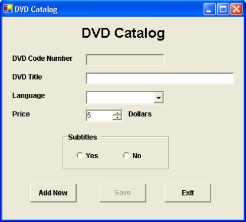
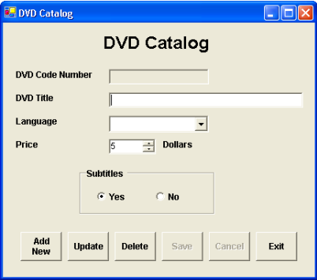
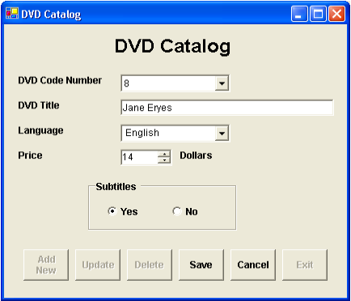

# Buổi 3
### Bài 1:
Tạo CDSL tên `DVDLibrary` gồm 1 bảng là `DVD` có cấu trúc như sau:

| Tên cột      | Kiểu dữ liệu | Kích thước | Mô tả                          |
|--------------|--------------|------------|--------------------------------|
| DVDCodeNo    | NUMERIC      | 9          | Mã DVD, là khóa chính          |
| DVDTitle     | VARCHAR      | 40         | Tiêu đề của DVD                |
| DVDLang      | VARChAR      | 20         | Ngôn ngữ của DVD (có thể NULL) |
| DVDSubtitles | BOOLEAN      |            | Có phụ đề hay không            |
| DVDPrice     | NUMERIC      | 10         | Giá tiền                       |

Thiết kế một Jform chính như sau:

Thực hiện các yêu cầu sau:
- Khi Form được load lên thực hiện tạo kết nối và in tất cả các dữ liệu có trong bảng `DVDLibrary` ra **Console**.
  (dùng System.out.println())
- Khi button `AddNew` được click, một đối tượng `Statement` được tạo ra thực hiện câu truy vấn lấy về mã số lớn nhất của `DVDCodeNo` từ bảng `DVD`. Nếu bảng rỗng, một ngoại lệ được tạo ra. Vì thế ta phải bẫy lại ngoại lệ này nhằm kiểm tra khả năng bảng rỗng (lúc đó giá trị của biến `codeno` được gán là 0). 
  Sau đó giá trị của `codeno` tăng 1 để có giá trị hiện hành của `codeno`. Kế tiếp các trường của form được xóa trắng để một mẩu tin mới được thêm vào và kích hoạt nút `Save`.
- Khi click nút đóng, thực hiện đóng kết nối với CSDL.

### Bài 2:
Sửa đổi ứng dụng ở bài 1 để thêm chức năng cập nhật và xóa các mẩu tin. Giao diện chương trình trở thành:

Ứng dụng sửa đổi có một số chức năng:
1. Ban đầu các buttons `Save` & `Cancel` bị vô hiệu hóa (`setEnable(false)`).
2. Khi người dùng click buttons `Update` hay `Delete`, textbox `DVDCodeNumber` sẽ bị thay thế bởi 1 Combobox để người dùng có thể lựa chọn giá trị các mã DVD (`DVDCode`) từ ComboBox. Nếu buttons `Update` (`AddNew` hay `Delete`) được click; các buttons `AddNew`, `Update`, `Delete` bị vô hiệu hóa; các button `Save` & `Cancel` trở nên có hiệu lực (enable).
3. Dựa trên mã DVD (`DVDCode`) từ Combobox, thông tin chi tiết về đĩa DVD có mã được lựa chọn sẽ được hiển thị chi tiết trên form. 
4. Khi người dùng thay đổi giá trị của đĩa DVD hiện hành và click `Save`, các thông tin sửa đổi sẽ được lưu
vào cơ sở dữ liệu; các buttons `AddNew` và `Delete` trở nên có hiệu lực (buttons `Save` & `Cancel` mất hiệu lực).
5. Tương tự khi người dùng click `Delete`, một thông điệp để người dùng xác nhận có muốn xóa thông tin của DVD hiện hành không? Nếu người dùng xác nhận là muốn xóa, thông tin về DVD hiện hành bị xóa khỏi cơ sở dữ liệu.
6. Khi người dùng click button `AddNew` sau khi đã thực hiện các thao tác như `Update` hay `Delete`; Combobox `DVDCodeNo` sẽ bị thay thế bởi textbox `DVDCodeNumber`.
7. Khi người dùng click button `Cancel`; không có sự thay đổi nào xảy ra; mọi thứ trở lại bình thường như cũ.

Ví dụ: khi người dùng click button `Update` và chọn mã DVD từ combobox (Các buttons `AddNew`, `Update`, `Delete` bị mất hiệu lực và các buttons Save, Cancel có hiệu lực).

