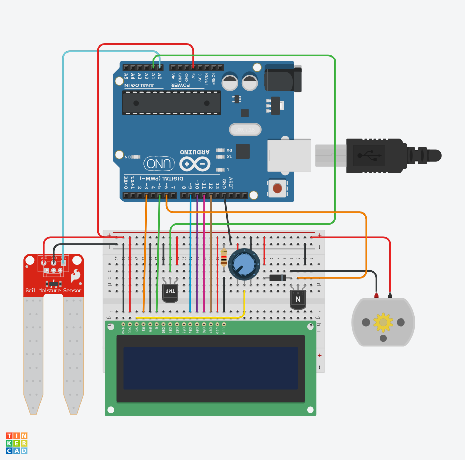

# Assignment 3
## Task 1
Install the circuit to connect the Arduino Uno to the TMP36 temperature sensor, soil moisture sensor.

Write a program to read the temperature, and moisture from the temperature sensor, soil moisture sensor and display it on the computer screen.
## Task 2
Install the circuit to connect the Arduino Uno to the TMP36 temperature sensor, soil moisture sensor, and LCD 1602

Write a program to read moisture from the soil moisture sensorand display it on the LCD
## Task 3
Install the circuit to connect the Arduino Uno to the TMP36 temperature sensor, soil moisture sensor, DC motor, and LCD 1602

Write a program:
- to read temperature and moisture from the temperature sensor, and soil moisture sensor and display them on the LCD
- If Moisture less than or equal 50 then display “Motor: On” and turn on DC motor
- If Moisture greater than 50 then display “Motor: Off” and turn off DC motor.
## Task 4
Install the circuit to connect the Arduino Uno to the TMP36 temperature sensor, DC motor, and LCD 1602

Write a program:
- to read temperature and moisture from the temperature sensor, and soil moisture sensor and display them on the LCD
- If temperature less than or equal 30 then display “Motor: Off” and turn off DC motor
- If temperature greater than 30 then display “Motor: ON” and turn on DC motor.

# Circuit
