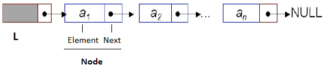
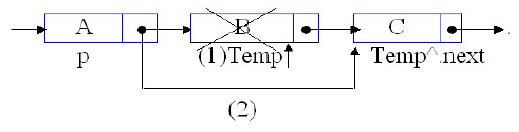

Cho mô hình một danh sách liên kết đơn các số nguyên như sau:

Giả sử kiểu dữ liệu List đã được khai báo. Vị trí của một phần tử trong danh sách được mô tả như ví dụ trong hình:

Viết hàm cho phép xóa phần tử ở vị trí p trong danh sách.

**Nguyên mẫu (Prototype)**
- Tên hàm: deleteList()
- Tham số: 
    - p: Kiểu vị trí
    - pL: con trỏ kiểu List
- Kiểu trả về: không

**Thân hàm (Body)**
- Xóa phần tử ở vị trí p trong danh sách chỉ bởi con trỏ pL

**Chú ý**
- Chỉ viết phần hàm, KHÔNG VIẾT TOÀN BỘ CHƯƠNG TRÌNH