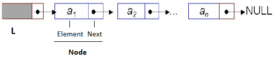

# Danh sách liên kết

Danh sách liên kết được coi như là một tập các nút (ô) rời rạc nhau, mỗi nút gồm 2 thông tin: giá trị của mỗi phần tử và địa chỉ của nút (ô) kế tiếp.

Trong đa số trường hợp người ta thêm nút (ô) đầu tiên làm chỉ điểm đầu của danh sách. Giá trị tại nút này không quan trọng, chỉ cần là trường liên kết của nó chỉ đến nút chứa giá trị của phần tử đầu tiên trong danh sách. Lúc đó, khi nói một danh sách liên kết L thì L chính là địa chỉ của nút (ô) đầu tiên này.

Hình ảnh của danh sách liên kết L được biểu diễn như sau:

Trong đó, Node là một cấu trúc gồm 2 trường:  Element là giá trị 1 phần tử của danh sách và Next chỉ địa chỉ của Node kế tiếp.

Một số phép toán cơ bản trên danh sách liên kết:

- makenullList(): Khởi tạo danh sách rỗng
- emptyList(): kiểm tra danh sách có rỗng hay không?
- insertList(): xen phần tử x vào vị trí p trong danh sách 
- append(): nối phần tử x vào danh sách
- addFirst(): thêm phần tử x vào đầu danh sách
- deleteList(): xóa phần tử ở vị trí p trong danh sách
- locate(): tìm vị trí xuất hiện đầu tiên của phần tử x trong danh sách 
- printList(): hiển thị giá trị các phần tử của danh sách
- readList(): nhập danh sách từ bàn phím