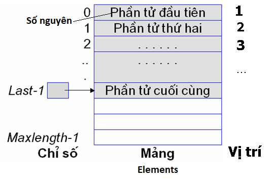

Cho mô hình một danh sách các số nguyên List như sau:

Hãy viết hàm liệt kê tất cả các phần tử của danh sách các số nguyên.
- Tên hàm (function name): printList()
- Tham số (parameters):
    - L - kiểu List
- Kiểu trả về: Không

**Thân hàm (Body)**
- Hiển thị giá trị của các phần tử trong danh sách

**Chú ý**
- Chỉ viết phần hàm, KHÔNG VIẾT TOÀN BỘ CHƯƠNG TRÌNH