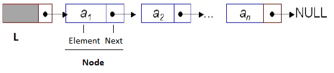

Cho mô hình một danh sách các số nguyên List như sau:

Bằng cách sử dụng những phép toán chuẩn trên danh sách, hãy viết chương trình cho phép tính trung bình cộng các phần tử trong danh sách

**Gợi ý**
- Khai báo kiểu List
- Định nghĩa các hàm nhập, hiển thị, trung bình cộng các phần tử
- Gọi thực thi các hàm trên trong hàm main()