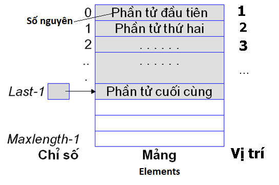

Cho mô hình một danh sách các số nguyên List biểu diễn tập hợp như sau:

Bằng cách sử dụng những phép toán chuẩn trên danh sách, hãy viết chương trình cho phép tìm tập hợp hợp của 2 danh sách biểu diễn tập hợp

**Gợi ý**
- Khai báo sử dụng thư viện danh sách AListLib.c 
- Định nghĩa các hàm nhập tập hợp và hiển thị danh sách
- Định nghĩa hàm tìm tập hợp hợp của 2 tập hợp
- Gọi thực thi các hàm trên trong hàm main()