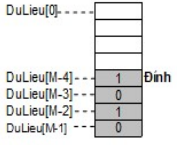

Cho mô hình một ngăn xếp các số nguyên cài đặt bằng mảng như sau:

Trong đó M = SoPhanTu= 100

Giả sử kiểu dữ liệu NganXep đã được khai báo. Viết hàm xóa phần tử tại vị trí đỉnh của ngăn xếp

**Nguyên mẫu (Prototype)**
- Tên hàm: xoa()
- Tham số: 
  - pS - con trỏ ngăn xếp
- Kiểu trả về: không

**Thân hàm (Body)**
  - Nếu ngăn xếp chưa rỗng, thay đổi vị trí đỉnh

**Chú ý**
- Chỉ viết hàm, KHÔNG VIẾT TOÀN BỘ CHƯƠNG TRÌNH
