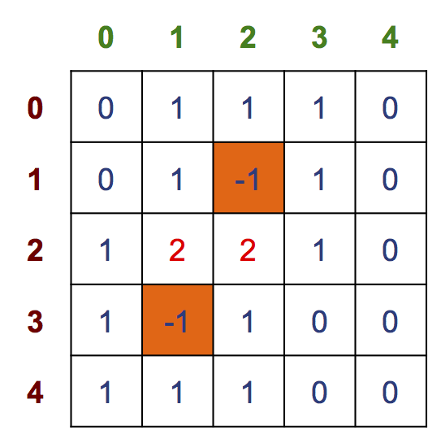

Cho 2 mảng toàn cục B và T dùng để lưu bản đồ mìn và trạng thái đóng/mở của các ô trong trò chơi MineSweeper.
```cpp
#define M 5
#define N 5
#define MINE -1
/*Mảng B lưu bảng đồ mìn*/
int B[M][N];
/*Mảng T lưu trạng thái các ô*/
int T[M][N];
```
Hãy viết hàm `printMap1()` để in bản đồ mìn theo quy tắc:
- Nếu ô B[i][j] == -1 (mìn), in ký tự ‘x’
- Nếu ô B[i][j] == 0, in ký tự ‘.’
- Ngược lại in giá trị của B[i][j]

Ví dụ: giả sử bảng đồ mìn B như bên dưới:



thì kết quả in ra sẽ là:
```
  0 1 2 3 4
0 . 1 1 1 .
1 . 1 x 1 .
2 1 2 2 1 .
3 1 x 1 . .
4 1 1 1 . .
```
**Khuôn dạng (prototype)**
- Tên hàm: printMap1
- Tham số: không
- Kiểu trả về: void

**Thân hàm:**
- In bản đồ mìn B theo quy tắc trên.

**Chú ý**
- Dữ liệu đầu vào luôn hợp lệ.
- Chỉ viết HÀM, không viết TOÀN BỘ CHƯƠNG TRÌNH
- Phải in luôn chỉ số hàng và chỉ số cột

**Gợi ý**
- Xem slides
- In hàng đầu (chỉ số cột)
- Dùng vòng lặp in từng hàng, với mỗi hàng in chỉ số hàng, sau đó in theo các giá trị của B[i][j].